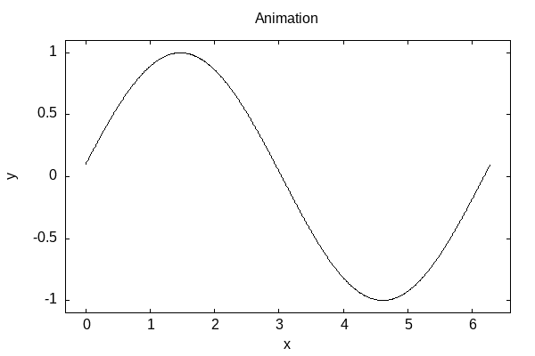

# [2-D Gallery](@id twodeegal)

(Many of these examples taken from, or inspired by, [@lazarusa's amazing gallery](https://lazarusa.github.io/gnuplot-examples/gallery/))

# Glowing curves
```@example 2dgal
using Gaston # hide
set(reset=true) # hide
set(termopts="size 550,325 font 'Consolas,11'") # hide
x = 0:0.3:4
a = exp.(- x)
b =  exp.(- x.^2)
plot(x, a, curveconf = "w lp lw 1 lc '#08F7FE' pt 7 t 'e^{-x}'",
     Axes(object="rectangle from screen 0,0 to screen 1,1 behind fc 'black' fs solid noborder",
          border="lw 1 lc 'white'",
          xtics="textcolor rgb 'white'",
          ytics="textcolor rgb 'white'",
          ylabel="'y' textcolor 'white'",
          xlabel="'x' textcolor 'white'",
          grid="ls 1 lc '#2A3459' dt 4",
          key="t r textcolor 'white'",
          style="fill transparent solid 0.08 noborder"))
plot!(x, b, curveconf = "w lp lw 1 lc '#FFE64D' pt 7 t 'e^{-x^2}'")
for i in 1:10
       plot!(x,a,w="l lw $(1 + 1.05*i) lc '#F508F7FE' t ''")
       plot!(x,b,w="l lw $(1 + 1.05*i) lc '#F5FFE64D' t ''")
end
plot!(x, a, curveconf = "w filledcu y=0 lw 1 lc '#08F7FE' t ''")
plot!(x, a, supp= b , curveconf = "w filledcu lw 1 lc '#FFE64D' t ''")
```

# Volcano data

```@example 2dgal
using RDatasets
volcano = Matrix{Float64}(dataset("datasets", "volcano"))
imagesc(volcano,
        Axes(palette = :inferno,
        auto="fix",
        size="ratio -1",
        title = "'Aukland s Maunga Whau Volcano'"))
```

# Animation

An animation can be produced by pushing new plots into an existing plot, and then saving the result as a GIF the the `animate` option.

```julia
closeall()  #hide
t = 0:0.01:2π
f(t,i) = sin.(t .+ i/10)
ac = Axes(title = :Animation, xlabel = :x, ylabel = :y);  # axes configuration
cc = "w l lc 'black' notitle"  # curve configuration
F = plot(t, f(t,1), curveconf = cc, ac);  # create the first frame, with handle 1
for i = 2:50
    pi = plot(t, f(t,i), curveconf = cc, ac, handle=2) # frames, with handle 2
    push!(F, pi)  # push the frame to F
end
save(term = "gif", saveopts = "animate size 600,400 delay 1",
     output="anim.gif", handle=1)
```



# Color from palette

```@example 2dgal
x = -2π:0.05:2π
plot(x, sin.(3x), supp = x, curveconf = "w l notitle lw 3 lc palette",
     Axes(palette = :ice))
```

# Categorical data

```@example 2dgal
using RDatasets
dset = dataset("datasets", "iris")
byCat = dset.Species
categ = unique(byCat)
ac = Axes(linetype = :tab10,
          xlabel = "'Sepal length'",
          ylabel = "'Sepal width'",
          auto = "fix",
          title = "'Iris dataset'",
          key = "b r font ',9' tit 'Species' box")
c = categ[1]
indc = findall(x -> x == c, byCat)
p = plot(dset.SepalLength[indc], dset.SepalWidth[indc],
         ac, curveconf = "w p tit '$(c)' pt 7 ps 1.4 ")
c = categ[1]
indc = findall(x -> x == c, byCat)
P = plot(dset.SepalLength[indc], dset.SepalWidth[indc],
         ac, curveconf = "w p tit '$(c)' pt 7 ps 1.4 ");
c = categ[2]
indc = findall(x -> x == c, byCat)
plot!(dset.SepalLength[indc], dset.SepalWidth[indc],
      curveconf = "w p tit '$(c)' pt 7 ps 1.4 ");
c = categ[3]
indc = findall(x -> x == c, byCat)
plot!(dset.SepalLength[indc], dset.SepalWidth[indc],
      curveconf = "w p tit '$(c)' pt 7 ps 1.4 ");
P
```
