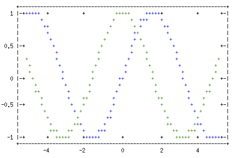
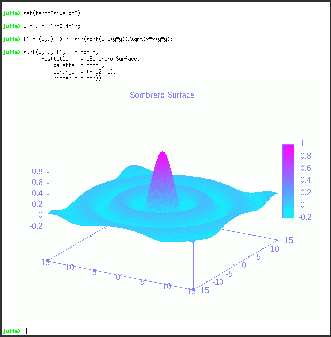

# Usage notes and FAQ

## How to set the terminal

Gnuplot supports a huge amount of terminals. Most modern gnuplot installations should support the qt terminal. A different terminal can be selected with

    set(term = t::String)

where `newterm` is the desired terminal. Most terminals accept a configuration string, which can be set with

    set(termopts = opt::String)

For example, to set the font on the qt terminal to Consolas size 11, one could do

    set(term = "qt")  # not needed in most installations
    set(termpts = "font 'Consolas,11')

## What settings are available in Gaston?

The `set` command can be used to configure Gaston's behavior. The following settings are available:

| Setting | Purpose |
|:--------|:--------|
| term | Sets gnuplot's terminal. |
| termopts | Sets the terminal's options. |
| mode    | If set to "null", plots are not shown. |
| preamble | A string that is sent to gnuplot for every plot. |
| debug | If set to `true`, all data sent to gnuplot is printed on the screen. |
| saveopts | A string that specifies options when saving a plot. |
| showable | For IJulia, Documenter.jl, Juno and similar uses. Defaults to `"png"`; all plots are generated in PNG format only. Set to `"svg"` to enable SVG plots, or `"png+svg"` to enable both.
| timeout | How long Gaston waits for gnuplot to complete a plot. Defaults to 10 seconds (20 on Windows and Mac); you may need to set it higher if your computer is slow or you're plotting lots of data.

## How to plot text or sixels?

Plots can be rendered using text on the console by setting the terminal to `dumb`:

```julia
using Gaston  # hide
set(reset=true)  # hide
set(term = "dumb", termopts = "size 80,25 ansirgb")
t = -5:0.1:5
plot(t, sin);
plot!(t, cos)
```



To plot with sixels, use

    set(term = "sixelgd")

A terminal that supports sixels is required (for example, xterm in mode vt340 (invoked as `xterm -ti vt340`).



# How to configure plot size in Documenter.jl, IJulia, etc?

In these environments, the front-end chooses among all supported MIME types. Gaston supports PNG and SVG images. Some of these front-ends, though, ask Gaston to produce plots in both formats, and then choose SVG. This is a waste of resources, and combined with the fact that plots in SVG format can grow very large, it is recommeded to configure Gaston to produce only PNG files. This is achieved with

    set(ijulia = "png")

The `png` terminal can be configured with

    set(termopts=...)

For example, the plots in this document are created with these settings:

    set(termopts="size 550,325 font 'Consolas,11'")

## I run `plot` inside a `for` loop and no plots are produced! (or: Julia's display system)

Julia separates the calculation of a result from the display of the result (see [custom pretty-printing](https://docs.julialang.org/en/v1/manual/types/#man-custom-pretty-printing-1) and [multimedia I/O](https://docs.julialang.org/en/v1/base/io-network/#Multimedia-I/O-1) in Julia's documentation). This mechanism is very powerful; in Gaston, it enables plotting to the REPL, Jupyter, Juno, or in Documenter.jl with just a few lines of code. In other words, plotting is not a side effect of running `plot`, the way it is in, say, Matlab; rather, a plot is produced when a result of type `Gaston.Figure` is returned by some code.

While elegant and powerful, this mechanism can also be surprising if you're used to side-effect plotting. None of the following code samples display any plots:

```julia
y = rand(20)
plot(y);  # note the final ; suppreses displaying the result
```

```julia
# nothing is returned by the for loop
for k = 1:5
    plot(k*y)
end
```

```julia
# function that does not return a figure
function f(y)
    plot(sin.(y))
    println("Sum = $(sum(y))")
end
```

The common problem in the code samples above is that a figure is never returned; in consequence, no figure is displayed. This can be fixed by making sure your code returns a figure; or alternatively, save the figure in a variable and display it when it is convenient. For example:

```julia
p = Gaston.Figure[]
for k = 1:5
    push!(p, plot(k*y))
end
```

Now, `p[3]` returns the third plot (for example). Another way to force the figure to be rendered is to call `display()`:

```julia
# all five figures are displayed
closeall()
for k = 1:5
    figure()
    display(plot(k*y))
end
```
## How does gnuplot report errors?

Gnuplot's main drawback, from a usability standpoint, is that it is not a library; it is designed to be used interactively. Gaston simulates a user typing interactive commands in a gnuplot session. Gaston tries to catch any errors reported back by gnuplot.

An example of an error returned by gnuplot and caught by Gaston:

```julia
using Gaston # hide
y = rand(20)
plot(y, plotstyle="linepoints")  # missing an 's'
```

results in an error message like:

```julia
┌ Warning: Gnuplot returned an error message:
│
│ gnuplot> plot '/tmp/jl_d8yIs9' i 0  with linepoints
│                                                     ^
│          line 0: unrecognized plot type
│
└ @ Gaston ~/.julia/dev/Gaston/src/gaston_llplot.jl:172
```

Gaston does its best effort to read and display any warnings or errors produced by gnuplot, and to recover gracefully. In some corner cases, it might happen that the communication link enters an unforeseen state and a restart is required. Please file a Gaston issue if you experience this.

## Support

Please post support questions to [Julia's discuss forum](https://discourse.julialang.org/tag/plotting).

## Contributing

Bug reports, suggestions and pull requests are welcome at [Gaston's github page](https://github.com/mbaz/Gaston.jl)
